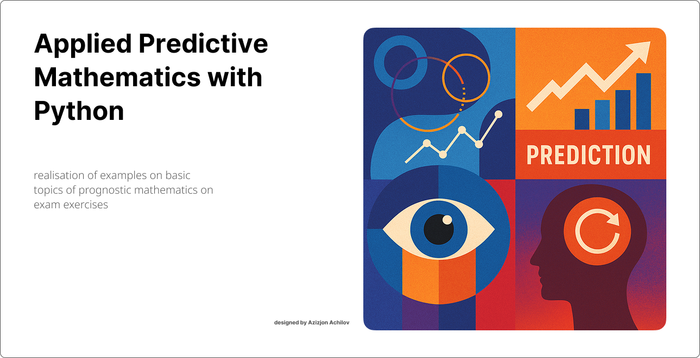

# Applied-Predictive-Mathematics-with-Python

This repository contains practical implementations of core predictive mathematics concepts applied to real-world exam problems using Python.

## Topics Covered
- Descriptive Statistics
- Probability and Set Theory
- Bayesian Inference
- Probability Distributions (Normal, Uniform, Poisson)
- Linear and Logistic Regression
- Principal Component Analysis (PCA)
- Correlation and Covariance
- Classification Models

## Notebooks Overview
- 📁 notebooks/
  - 01_descriptive_stats.ipynb – basic measures of central tendency and variation
  - 02_probability.ipynb – problems involving probabilities and Venn diagrams
  - 03_bayes_rule.ipynb – problems using Bayes’ theorem
  - ...

надо закончить
